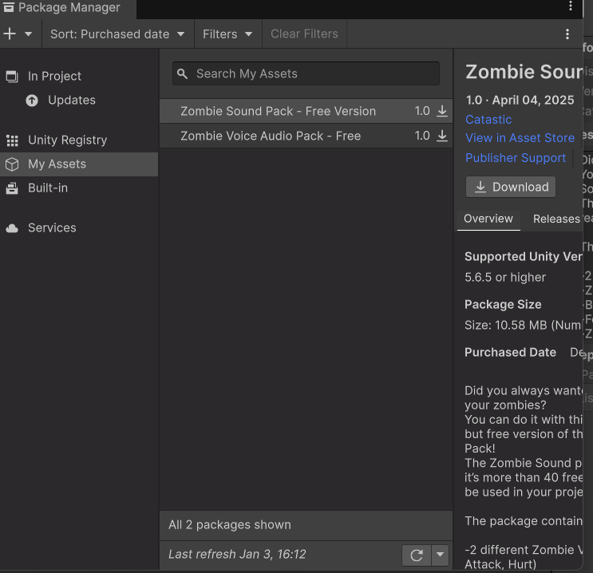
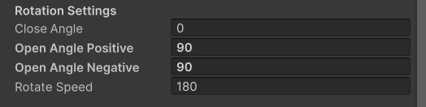
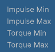
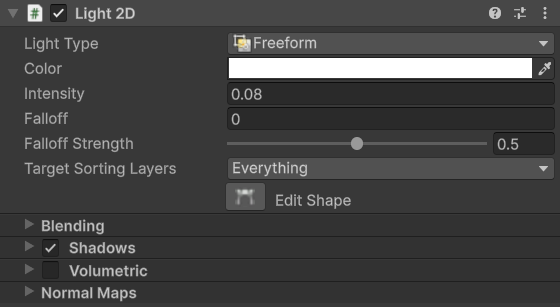
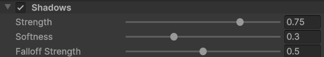
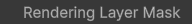
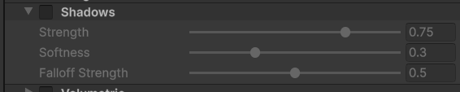
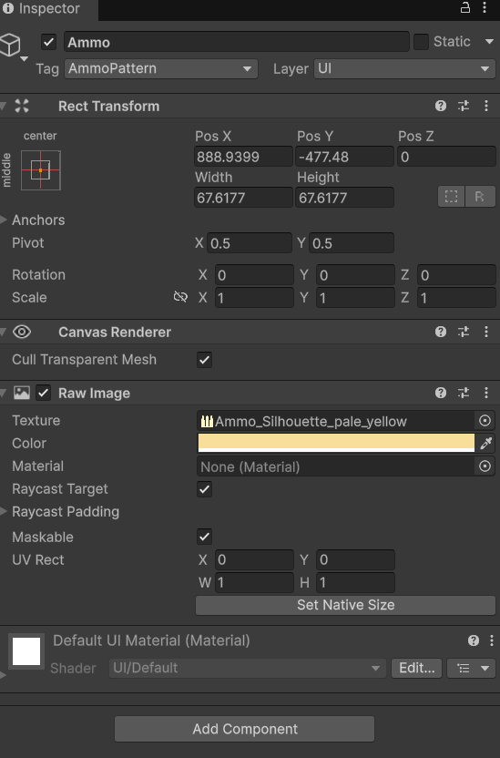
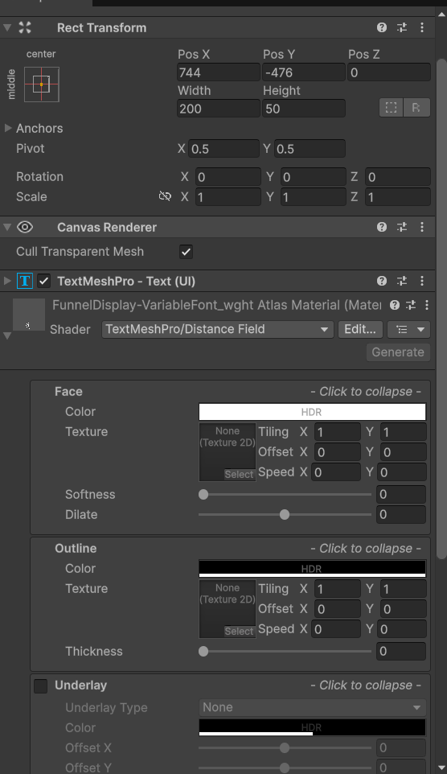

 
請你幫我把整個資料夾讀取過一遍，這是我的一個遊戲專案使用unity6000是用C#編寫的， 

請幫我釐清以下的問題:
1.我有一個Boss他的程式在Assets\Scripts\Mobs\RangedZombie.cs請你先幫我看一下
2.我的Player的操控在Assets\Scripts\Player\Player.cs
3.我的近戰武器操控的程式碼在Assets\Scripts\Weapons\MeleeWeapon.cs

我希望你幫我釐清player用近戰攻擊boss時不會產生任何的傷害，請幫我釐清問題在哪裡，如果你有什麼問題請你先跟我說

我有一個問題想請教你，你有找到在Assets\Scripts\Mobs\RangedZombie.cs和Assets\Scripts\Mobs\Zombie.cs中有使用NavMesh的PackManager的套件嗎

是的，但這裡你好像無法看到有關NavMeshSurface的東西

在我兩個zombie的程式碼中，我應改有加入類似的偵測障礙物的程式碼了，請你幫我看一下

Zombie 會卡在某些障礙物上和迴避效果不理想如果可以幫我用NavMesh的話會更好，因為我有看過覺得NavMesh比較好

還是有辦法不用NavMesh達到更好的效果，就是單純的程式碼控制，請你幫我看一下

我想要改變zombie們的扣血邏輯，player.cs中應該有血量和護甲值得設定，請你幫我改成受到傷害優先扣護甲值，護甲扣完才扣生命值，請你幫我看一下

你能找到chestDrop 2D、KeyPickup2D、Keyring、RequiresKeyAnyOf2D、DoorController、DoorTrigger的程式碼嗎，我想要讓鑰匙可以打開門或寶箱，但我之前做出太雜亂的東西請你幫我優化和整理，我的想法是放在key上的程式碼可以幫我分類選擇此物件是DoorKey還是ChestKey讓他們的功能不一樣。還有們的部分我想讓他去偵測player的位置讓他可以更合理的開門，就是他會朝玩家面向的方向打開門。Door和Chest也請幫我做出能夠選擇要不要鎖起來，這是我門的配置方式。

我的遊戲是2d的並且出現這個問題Assets\Scripts\Object\DoorController.cs(322,27): error CS0034: Operator '+' is ambiguous on operands of type 'Vector2' and 'Vector3'

我還有一點問題，就是我其實已經有拾取地板物件ItemWorldPickup、丟棄物件EquippedItemDisplay、物品欄ContainerManager這些了，所以Keyring其實可以不用了，請幫我把開鎖就是開門和寶箱的開啟方式改成拿鑰匙靠近就可以了，不用按E什麼的，門的部分就是解鎖後就把他的狀態改成打開的，寶箱部分就還好因為開啟後他就會消失了。

真的有辦法做滾輪選物品嗎

請你幫我找到Pistol.cs的程式碼，他在做射擊時消耗的彈藥圖案在螢幕中顯示是錯的，請你幫我看一下，會讓我可以選擇我要的是哪一個。我應該有在裡面加入空彈藥時會產生音效，你幫我檢查一下

你幫我把整個專案都看過一次並且幫我把有問題的都先列出來，能夠優化的也都幫我列出來，先不要做任何的修改，只要列出來等待我討論。

如果都請你幫忙修復和優化是可以的嗎

一個階段一個階段用好了，先用第一階段

Assets\Scripts\Weapons\Bow.cs(178,13): error CS0103: The name 'arrowPattern' does not exist in the current context
Assets\Scripts\Weapons\Bow.cs(178,27): error CS0103: The name 'arrowPattern' does not exist in the current context

好的，修改第二階段

好的，進行第三階段

請你幫我把整個資料夾讀取過一遍，這是我的一個遊戲專案使用unity6000是用C#編寫的，尤其是DoorTrigger和DoorController的程式碼，因為這部分有一點問題，我理想上是他會去偵測player的位置去改變開門的方向，但是實際上我去更改open angle postive和open angle negative的值，他只會看open angle postive的值，去改變方向，請你幫我看一下

對的，我有把門轉了 90 度

我還有一個問題就是我的key本來是針對一個門一個門的，但是現在我把門放在一起，讓他變成雙開門，所以我希望可以新增一個部分是可以針對多個門的的綁定，用一支鑰匙同時開兩扇門。

這幾個在寶箱上的屬性是什麼

檢查Door和Chest的程式碼，因為我原本是要做手持鑰匙才會開啟但現在是只要身上有鑰匙就可以開啟，請你幫我看一下

寶相開啟時有延遲，就是他會等一下才銷毀和掉落東西，這是可以讓它不要有延遲的嗎

zombie中哪一個是調整他的偵測範圍

現在zombie有一個問題就是他會被player擊退到wall裡面，請你幫我看一下

你幫我檢查一下player的程式碼因為我把player的circle collider的size改大了，但他就受不了傷了，請你幫我看一下

現在player被zombie擊退時，有大機率會開始原地旋轉或抖動，請你幫我調整一下，或跟我說要怎麼調整

以上對zombie的調整你有把RangedZombie也算進去一起調整嗎，如果沒有請你調整，然後關於RangedZombie的攻擊方式，我的想法是他在進入一定範圍後改為近戰攻擊，但並沒有實施，請你幫我看一下

我有一個問題就是，我把Pistol放入chest裡面，Pistol掉出來後player撿起來Pistol可以開槍也有聲音但不會有子彈也會有莫名的擊退player的效果

有辦法讓player身處的房間是可見的，就是會受到Global Light 2D所影響，而在房間外的則是全暗嗎，請先不要修改，先跟我討論

我想用「方案二（局部光）」。我的地圖是用 Tilemap 做的，沒有把房間分成了獨立的物件。

好的請幫我寫一個局部光的系統和教我設定。有 0.5 秒左右的漸變、牆壁有設定 Shadow Caster 2D、大廳連接小房間分開亮。

他只有呈現一個星星狀的光，沒有呈現出整個房間的光，請你幫我看一下

我使用global light 2d 是可以的，但他是整個場景都亮起來，這是可以調整的嗎，還是只能用Sprite Light 2D

只有這些選項

這些設定分別是什麼

我的房間中有其他物件也有shadow caster 2d，是可以讓它不會被局部燈照到而產生陰影嗎，就讓它只會被player的flashlight影響

我還有地板但它沒辦法通時選擇兩個sorting layers，我想要它可以被flashlight照到和局部燈照到，但它們部會產生陰影，只會亮而已

等等我的shadow的設定只有這些

這是什麼

好了我知道了，回歸到最原始的設定，就是到我提出free light的設定那裡

因為我只是要有局部光而已，所以根本就不需要什麼影子，因此我把這個關了

子彈還是依然會射到player並造成傷害，請你幫我看一下

我想解決一個問題就是Pistol它擷取不到Ammo的圖片和字，請你幫我看一下

因為我的圖片和字是object，所以他一直顯示type mismatch，請你幫我看一下

這是我想放的圖片和字，這是結果

你可以幫我檢查plyer或是UI的程式碼裡面是否有設定子彈圖標的初始值嗎，因為player只要手裡是空的，圖標就會顯示弓箭的樣子，請顯示彈藥的樣子

我想要把AK和pistol的子彈消耗數量分開，但他們的程式碼都是pistol，所以請你幫我修改，並且幫我加入能夠補充彈藥的物件，也要分AK和pistol程式碼可以視同一個，但要有選項可以選擇他是哪一種彈藥，請你幫我看一下

我想請問一個問題是局部燈每一個都是分開的嗎，因為我怕我觸發其中一個的的時候另一個也會觸發，請你幫我看一下

所以我可以把它變成prefabs嗎

你是有辦法提供網址的嗎，因為我想找背景音樂和走路音效

我想要新增背景音樂，要怎麼做

Cannot create resource file for asset: 'Assets/Art/Audio/BackGround/BackGround.wav'
(Filename: C:\build\output\unity\unity\Modules\AssetPipelineEditor\Public\AudioImporter.cpp Line: 1132)
這是為什麼

我個防毒軟體想封鎖這個，這好像就是原因

將它切成一小段一小段（每一聲是一跳）。這一部分是要怎麼做

我有不同材質的走路聲，那我要怎麼做，用trigger嗎

但是我的地板都是用同一個Tilemap

不是的，我的wood和concrete都是用同一個Tilemap去做的，名字是一樣的，只是裡面的圖片不同而已

真的不能用trigger嗎，因為我不同的名字也會用到同一個聲音，還是有其他辦法

不同的材質可以有不同的播放速度嗎，因為音源不一樣

我有打算做ZombieMoan的聲音，我的想法是在zombie的偵測範圍內播放，離開後則不播，但要把最後的播完，不然突然停掉很怪，我有複數的音檔

同時間發現多個zombie時，他們的聲音好像會固定一起播放，連延遲時間也很近，請你幫我看一下

 這些設定是什麼

我想要加入開寶箱的音效，請你幫我找一下

希望你把全部的程式碼看過一次後幫我把不必要的debug都刪掉必要的則留下，但預設事先關起來，也希望你把註解的部分改成統一風格，沒有註解加上註解，太多的則精簡一下，總之就是都要有註解但不要亂和多

輔助線也設開關，也預設關閉

這是什麼警告

幫我加上防錯

這是什麼警告

我現在要做一個死亡介面和結束介面，我已經有一個開始介面了，但還沒實裝。都是要以場景切換為主。

只有這個

我開始也是一個場景

我要找按鈕素材

你幫我找關鍵字

Game UI design, a set of 2D buttons for horror survival game, rusty metal texture, dark charcoal and crimson color palette, highly detailed, flat design, white background, cinematic lighting, 4k.

我想要上面有寫 Restart、Exit、Start 這三個按鈕

 這種風格

請你教我如何使用這些素材

怎麼用

幫我加入zombie們死掉後會掉落物品的功能加進去，跟chest的差不多就好

我的door的影子很不穩定時而看box collider有影子不會穿過去又有時候會穿過去時而看sprite renderer有影子不會穿過去又有時候會穿過去，請你幫我看一下

 zombie中這是什麼

 這個呢

restart後有很多設定都不見了

在遠程殭屍的動畫設定中，可以請你加入或修正可以從攻擊直接進入走路動畫嗎，不然會卡一下

現在有一個問題是明明冷卻時間還沒到，但它卻會播放攻擊動畫，請你幫我看一下

我想要找一個打boss的背景音樂，但我一樣想要維持原本的感覺

幫我加入調整音量

不是的，我說的是boss的背景音樂的音量

這是什麼問題

這是什麼問題

我突然結束時會出現這個，就是我按上面的停止時會出現

我現在要把開始選單和結束選單更改成只有文字和文字按鈕，請你推薦我幾個字體

我下載下來了，請問我要如何使用，他下載下來是zip檔

  這是幾個檔案哪一個

 哪一個

我只想要純文字，但它都會顯示按鈕的底色，就是下面那一塊

他的感應範圍很小，要怎麼去修改

我想要在死亡重新開始的選單多一點互動，就是我將鼠標放在restart的按鈕上時旁邊物件的燈會亮起來，預設是暗的

幫我找你說的通電聲和按鈕按下的聲音，然後幫我做你說的呼吸燈

撤回呼吸燈和HorrorFlicker的更動，我覺得不好

場景切換時背景音樂一樣繼續播放

不是的，繼續播放是一個bug要改成不要繼續播放，像是切換到選單場景則播選單的背景音樂，停掉遊戲的背景音樂，以此類推

我快速的滑過按鈕時，他的變色就會卡住，持續顯示變色的那個顏色，請你幫我看一下

我想要問你你的全域音樂的那個東西是什麼，要怎麼用

我想要新增可以調整整個遊戲的亮度和音量的設定，我要把它放在StartMenu場景中，請你幫我看一下

我打算做一個Setting的按鈕那些拉桿或設定的東西都要我按下後出現，然後場景就在後面變成霧霧的，我保存好後就直接退出，並且場景變回原來樣子就是沒有霧霧的，你能理解嗎，並且告訴我要怎麼設定

 是這個取消嗎

MainMenuPanel這是什麼，是要把原本的按鈕和title都放在裡面嗎

MainMenuPanel (原本的主選單按鈕)
SettingsPanel (預設設為 隱藏/Deactive) 👈 這就是你要做出的彈出層
Backdrop (一張黑色透明的圖片，填滿螢幕)
SettingsWindow (放在中間，包含你的 Slider 和文字)
CloseButton (一個按鈕，寫著 「SAVE & BACK」)
這些分別是什麼物件，像是panel這種東西，我比較好知道要怎麼新增

我Setting要按第二次才有反應，請你幫我看一下

亮度的部分看起來沒有差異，是我沒有設定好嗎，你再跟我講一次，請你幫我看一下

 是這樣放嗎，因為還是沒有效果

好了，但它似乎沒有套到全部的場景裡，請你幫我看一下

只是這樣我在編輯的時候看不到畫面，我可以讓它取消勾選，可以改成按下play之後再讓他enable嗎

我需要在play之後手動再放入其他場景的canva它才會在其他場景套用，請你幫我看一下

有了，但我發現其他的問題就是，在SFX的設定中它好像只調整到buttonclick的音效而已，其他的zombiemaon和走路聲音等等的音效都沒有改變，請你幫我看一下有聲音的除了背景音樂的都檢查一下

我發現一件事，就是你是否把每一個音效的大小都調成通一個值了，我有在每一個我有音量大小的設定條音量，請你把那個音量作為基準調整，因為每一個音檔的大小不一樣他們呈現的就不一樣

我還要新增Boss(ranged zombie)的血條和有鎖的門開鎖時要用QTE，你應該有看到我的程式碼裡面有QTE這個東西吧。假如QTE失敗鑰匙並不會消失，只是需要重新進入開鎖區域，再試一次QTE。Boss(ranged zombie)的血條的部分就是要是比較大的，一樣要有我可以調整的地方，像是調大小、長度、位置之類的

QTE的部分有bug，就是開始顯示出來的的時候，我還沒按就會幫我點，導致一直失敗，而且我要的是失敗後要重新進入door的感應區，才能再次顯示QTE來做開鎖

現在的bug是不會顯示QTE並且幫我加入進行QTE時不能移動，被攻擊則直接判定失敗，請你幫我看一下

現在的bug是失敗了也會開啟，之前的進入trigger開門是不是沒有在門是locked的時候取消，改為QTE對了才開啟

現在的bug是無法點擊QTE並且有Console 會變紅色報錯，請你幫我看一下

我要設定為左鍵反應並且我需要在hierarchy中設定在canva裡嗎

好了，但他還是有[Door] DoorUnit (1) 無法觸發 QTE (缺少 Prefab 或 Canvas)。門將維持上鎖狀態。
UnityEngine.Debug:LogError (object)
DoorController:StartQTE () (at Assets/Scripts/Object/DoorController.cs:225)
DoorController:TryOpen () (at Assets/Scripts/Object/DoorController.cs:271)
DoorController:OnPlayerEnter (UnityEngine.Transform) (at Assets/Scripts/Object/DoorController.cs:129)
DoorTrigger:OnTriggerEnter2D (UnityEngine.Collider2D) (at Assets/Scripts/Object/DoorTrigger.cs:61)

並且有概率發生成功區域跟失敗區域互換的問題，請你幫我看一下

跟我講一下boss血條的設定方式

血條的部分請在進入boss的範圍再顯示

health pickup 2D 可以幫我調整成血量到70%才能撿嗎 

請你把全部的程式碼都看過一遍，並且跟我解釋他是幹嘛的而且怎麼運作的